# Front-End-Developer-


Introducción

- **HTML**
    
    Son siglas en ingles de HyperText Markup Language o Lenguaje de Marcado de Hipertexto.
    
    ### ¿Para qué sirve?
    
    Nos sirve para estructurar toda nuestra página web, si hacemos la referencia con el cuerpo humano es como el sistema óseo, lo vamos a utilizar para colocar texto, imágenes, botones, videos, etc. Nos da una estructura inicial.
    
    
    - **Motores de renderizado**
    
    Cuando escribimos nuestros archivos HTML y CSS con ciertas etiquetas, selectores, atributos, propiedades, etc, todo eso el navegador no lo entiende y para poder entenderlo cada navegador tiene un motor que le permite entender y hacer visible en pixeles lo que nosotros hemos escrito.
    
    Cada navegador tiene diferentes motores, pero realizan el mismo proceso.


- **Anatomía de un documento HTML y sus elementos**

Antes de empezar a escribir código HTML, debemos conocer la anatomía de un documento y sus elementos.

¿Cuáles son los elementos HTML?
Los elementos son cada una de las partes que conforman un archivo HTML. Su estructura contiene:

Etiquetas: es la representación de un elemento HTML. Se dividen en etiquetas de apertura, representadas por ```<etiqueta>``` y etiquetas de cierre, representadas por ```</etiqueta>```.
Contenido: es el texto o elementos encerrados por la etiqueta, este valor es opcional en algunas de ellas.
Anatomía de un elemento HTML
**Qué son atributos HTML**
Los atributos HTML son propiedades en la etiqueta de apertura que manejan el comportamiento del elemento. Su valor está envuelto en comillas.

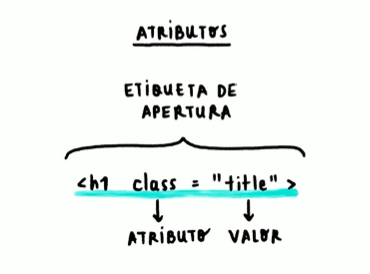 

**Qué son los elementos vacíos**
Los elementos vacíos son aquellos que únicamente se representan en una etiqueta de apertura. Por ejemplo, la etiqueta de imagen: ``````

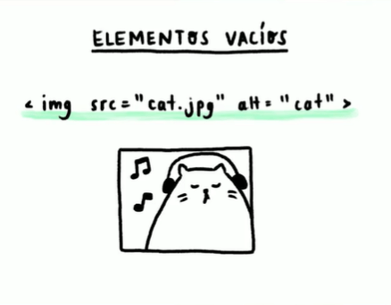 

Estas etiquetas pueden cerrarse en la misma etiqueta de apertura, utilizando la barra inclinada “/” al final: ``````.

**Qué es el anidamiento de elementos**

El anidamiento de elementos HTML consiste en envolver varias etiquetas en otras etiquetas.

Interpreta a cada elemento HTML como una caja donde puedes guardar diferentes elementos u otras cajas. Estas cajas tendrán diferentes tamaños y estarán colocadas junto a otras.

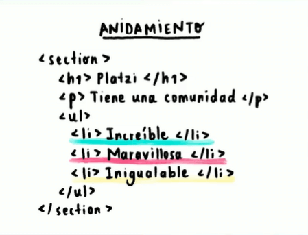 


Aquellas etiquetas que envuelven a otras se las denomina “padres”. Es decir, ```<section>``` es padre de ```<h1>```, ```<p>```, ```<ul>```, y a su vez ```<ul>``` es padre de 3 etiquetas ```<li>```

Las etiquetas que son el contenido de otras, se las denomina “hijos”. Es decir, las etiquetas ```<h1>```, ```<p>```, ```<ul>``` son hijos de ```<section>```, y a su vez las etiquetas ```<li>``` son hijos de ```<ul>```.

- **Estructura básica de un documento HTML**
La estructura básica de un documento HTML está configurado por las siguientes etiquetas principales:


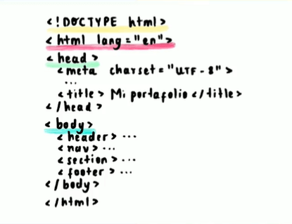 

Etiqueta Doctype
La etiqueta ```<!DOCTYPE html>``` especifica que el archivo se maneje con la versión 5 de HTML.

Etiqueta html
La etiqueta ```<html>``` define el elemento raíz de un documento HTML. Todos los demás elementos deben estar contenidos dentro de este elemento raíz. En esta etiqueta se especifica el lenguaje de la página web mediante la propiedad lang.

Etiqueta head
La etiqueta ```<head>``` define la metainformación, es decir, toda información que no es contenido como tal de la página web. Por ejemplo, los enlaces a archivos CSS y JavaScript, el título y la imagen que aparecen en la pestaña del navegador. Esto es importante para motores de búsqueda como Google.

Etiqueta body
La etiqueta ```<body>``` define el contenido de la página web. Debe ser hijo cercano de "html" y padre de todas las etiquetas HTML, excepto por aquellas que definan metainformación.

- **Comentarios de HTML**
Los comentarios de HTML consiste en señalar algo que se ignorará. Para establecer un comentario HTML se lo envuelve entre <!-- y -->, independiente de la cantidad de líneas.

```html
<!-- Este es un comentario de una línea -->
<!--
Este es un comentario de varias líneas
-->
```
Desafío: construye la estructura de un documento HTML
Utiliza tu editor Visual Studio Code o la herramienta codi.link. Si utilizas codi.link puedes visualizar toda la página web en la opción “Preview”.

Solución al reto

- **¿Qué es HTML semántico?**

El HTML semántico consiste en que cada elemento tenga su propia etiqueta que lo defina correctamente. Sin utilizar etiquetas muy generales, como ```<div>``` o ```<span>```

El problema con la etiqueta div
La etiqueta div define un bloque genérico de contenido, que no tiene ningún valor semántico. Se utiliza para elementos de diseño como contenedores.

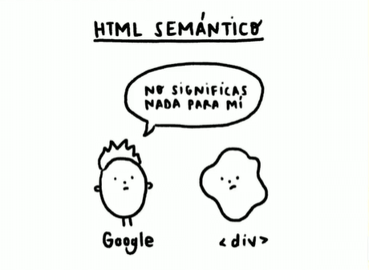 

¿Cuáles son las etiquetas semánticas?
Las etiquetas semánticas para definir una interfaz de una página web son:

```<header>```: define el encabezado de la página (no confundir con ```<head>```).
```<nav>```: define una barra de navegación que incluye enlaces.
```<section>```: define una sección de la página.
```<footer>```: define un pie de página o de sección.
```<article>```: define un artículo, el cual puede tener su propio encabezado, navegación, sección o pie de página.
Ahora que ya conoces las etiquetas semánticas, evita el uso excesivo de ```<div>```.

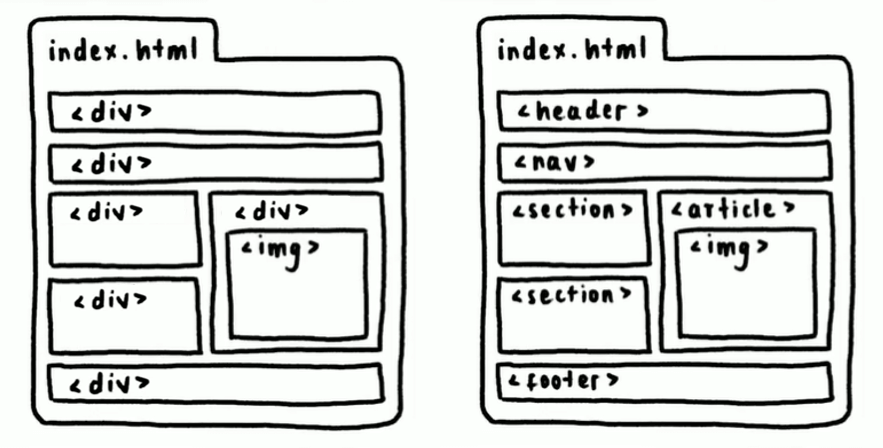 

Ventajas de utilizar HTML semántico
Las ventajas de utilizar un HTML semántico son:

Ayuda a tu sitio a ser accesible
Mejora tu posicionamiento (SEO)
Código más claro, legible y mantenible
Ayuda a buscadores (como Google) a encontrar tu página


- **Etiquetas de HTML más usadas**


HTML Reference - A free guide to all HTML elements and attributes.

http://htmlreference.io/


curso-frontend-developer/etiquetas.html at 5108689bdb6599cc92bd9595db28784f9be48704 · platzi/curso-frontend-developer · GitHub

https://github.com/platzi/curso-frontend-developer/blob/5108689bdb6599cc92bd9595db28784f9be48704/curso-1/etiquetas.html


44 etiquetas HTML que debes conocer

https://platzi.com/blog/etiquetas-html-debes-conocer/


- **Anatomía de una declaración CSS: selectores, propiedades y valores**

Antes de empezar a escribir código CSS, debemos conocer la anatomía de una declaración de estilos.

Qué es una declaración de CSS
Una declaración de CSS es un bloque que especifica el conjunto de estilos que se añadirán a un elemento HTML. Su estructura contiene lo siguiente:

Selector: define el elemento o conjunto de elementos a los cuales se añadirán los estilos.
Propiedad: es el nombre del estilo de CSS.
Valor: es el valor que tomará la propiedad.


Qué son comentarios de CSS
Los comentarios de CSS consisten en señalar algo que se ignorará. Para establecer un comentario CSS se lo envuelve entre /* y */, independiente de la cantidad de líneas.

```css
/* Este es un comentario de una línea */
/* 
Este es un comentario de varias líneas
*/
```
Propiedades iniciales de CSS
Antes de empezar con CSS utilizaremos algunas propiedades de CSS.

color: establece el color del texto de un elemento.
background-color: establece un color de fondo al elemento.
font-size: establece el tamaño de la fuente.
width: establece la anchura de un elemento.
height: establece la altura de un elemento.
Medidas iniciales
Estas son las medidas iniciales que debes conocer para establecer tamaños de elementos o de tipografía:

px: establece una longitud de píxeles.
%: establece un porcentaje con respecto a una medida base.
Profundiza más sobre el tema de medidas en:

Unidades de medida
https://platzi.com/clases/2467-frontend-developer/40844-unidades-de-medida/


- **Tipos de selectores: básicos y combinadores**

El selector define el elemento o conjunto de elementos HTML a los cuales se añadirán estilos. Existen nombres de colores propios de CSS que puedes explorar. A continuación veamos más sobre selectores.
https://htmlcolorcodes.com/es/nombres-de-los-colores/
Cuáles son los selectores básicos
Un selector básico es la mínima expresión CSS para colocar estilos.
```css
selector {
    /* Estilos */
}
```


1. Selector de tipo
Selecciona todos los elementos que coincidan con el nombre de la etiqueta HTML.

```css
div {
    /* Todos los div en el documento */
}
```

Desafío de selector de tipo
Intenta dar un color de fondo a 10 etiquetas ```<div>``` con un solo selector, utiliza la propiedad background-color.

Desafío selector de tipo

Solución al desafío

2. Selector de clase
Selecciona todos los elementos que coincidan con las etiquetas HTML que contengan el atributo class

```html
<!--archivo HTML-->
<div class="card"> Soy una carta </div>
```
Para seleccionar estos elementos, se empieza por un punto . y seguido el valor exacto del atributo class de la etiqueta. Puede ser cualquier valor que desees colocar.

```css
.card {
    /* Todas las etiquetas con la clase "card" */
}
```

Puede existir más de un valor dentro del atributo class separados por espacios.
```html
<!--archivo HTML-->
<div class="card card1"> Soy una carta </div>
<div class="card card2"> Soy una carta </div>
```
```css
.card {
    /* Todas las etiquetas con la clase "card" */
}

.card1 {
    /* Todas las etiquetas con la clase "card1" */
}

.card2 {
    /* Todas las etiquetas con la clase "card2" */
}
```

Desafío de selector de clase
De un conjunto de etiquetas ```<div>``` intenta dar un color de fondo a las etiquetas que contengan la clase "card" con un solo selector. Después, intenta dar un color de letra diferente para las etiquetas que contengan "card1" y "card2"

Desafío selector de clase

Solución al desafío

3. Selector de identificador único (id)
Selecciona el único elemento que coincida con la etiqueta HTML que contenga el atributo id. Solo puede existir un valor id para todo el documento.
```html
<!--archivo HTML-->
<button id="eliminar"> Eliminar  </button>
```

Para seleccionar el elemento, se empieza por el símbolo de hashtag # y seguido el valor exacto del atributo id de la etiqueta. Puede ser cualquier valor que desees colocar.
```css
/* archivo CSS */
#eliminar {
    /* La única etiqueta con el id "eliminar" */
}
```

Desafío de selector de ID
De un conjunto de etiquetas <button>, existe un único botón para eliminar. Intenta colocar un color de fondo rojo a este elemento.

Desafío selector de ID

Solución al desafío

4. Selector de atributo
Selecciona los elementos que coincidan con la etiqueta HTML que contenga el atributo y valor especificado.

```html
<!--archivo HTML-->
<a href="https://platzi.com"> Ir a Platzi </a>
```

Para seleccionar los elementos, se empieza por el nombre de la etiqueta, seguido de corchetes [] que contiene el atributo y valor especificado.

```css
/* archivo CSS */
a[href=""https://platzi.com"] {
    /* Todas las etiquetas <a> con una propiedad href con valor "https://platzi.com" */
}
```

Desafío de selector de atributo
Intenta colocar un color de fondo a las etiquetas <a> que contengan el atributo href con el valor de "https://platzi.com".

Desafío selector de atributo

Solución al desafío

5. Selector universal
Selecciona todos los elementos del documento mediante un asterisco *.
```css
* {
    /* Todos los elementos */
}
```
Desafío de selector universal
Intenta colocar un color de fondo a todos los elementos del documento.

Desafío selector universal

Solución al desafío

Cuáles son los selectores combinadores
Un selector combinador es la unión de dos o más selectores básicos.

```css
selector1 selector2 selector3 {
    /* Estilos */
}
```
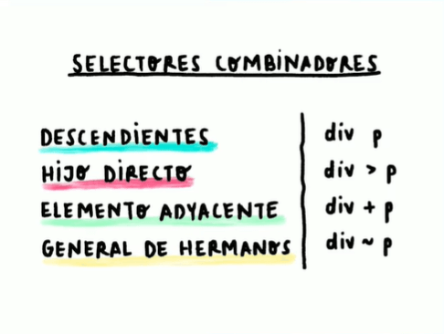

1. Combinador de descendientes
Selecciona todos los elementos del selector de la derecha que son hijos del selector de la izquierda, independientemente de la profundidad. Estos selectores están separados por un espacio.

```css
padre hijos {
    /* Todos los hijos del padre */
}

div p{
    /* Todos los hijos <p> de <div>*/
}

.container img{
    /* Todos los hijos  de la clase "container"*/
}

```

Desafío del combinador de descendientes
Intenta colocar un color de letra a todas las etiquetas ```<li>``` que son hijos de la clase ```<container>```.

Desafío combinador de descendientes

Solución al desafío

2. Combinador de hijo directo
Selecciona todos los elementos del selector de la derecha que son hijos directos del selector de la izquierda. Estos selectores están separados por >.

```css
padre > hijos_directos {
    /* Todos los hijos directos del padre */
}

div > p{
    /* Todos los hijos directos <p> de <div>*/
}

.container > img{
    /* Todos los hijos directos  de la clase "container"*/
}
```

Desafío de combinador de hijo directo
Intenta colocar un color de letra a todos las etiquetas ```<p>``` que son hijos directos de la clase ```<container>```.

Desafío combinador de hijo directo

Solución al desafío

3. Combinador de elemento adyacente
Selecciona todos los elementos del selector de la derecha que están adyacente al selector de la izquierda. Estos selectores están separados por +.

```css
elemento + adyacente {
    /* Elementos adyacentes */
}

div + p{
    /* Todos los <p> adyacentes a <div>*/
}

.container + img{
    /* Todos los  adyacentes a la clase "container"*/
}
```

Adyacente significa que comparten el mismo padre y está situado inmediatamente hacia abajo de otro elemento. Por ejemplo, en el siguiente código, ```html<div>``` está adyacente a ```html<h1>``` y ```html<p>``` está adyacente a ```html<div>```. Sin embargo, ```html<h1>``` no está adyacente a ```html<div>``` y ```html<div>``` no está adyacente a <p>.

```html
<!--archivo HTML -->
<h1>Soy un título </h1>
<div>Soy un div</div>
<p>Soy un párrafo</p>
```

Desafío de combinador de elemento adyacente
Intenta colocar un color de letra a todos las etiquetas <p> que están adyacente a las etiquetas <div>.

Desafío combinador de elemento adyacente

```css
elemento ~ hermanos {
    /* Elementos hermanos */
}

div ~ p{
    /* Todos los <p> hermanos de <div>*/
}

.container ~ img{
    /* Todos los  hermanos de la clase "container"*/
}
```

Solución al desafío

4. Combinador general de hermanos
Selecciona todos los elementos del selector de la derecha que son hermanos del selector de la izquierda. Estos selectores están separados por ~.


Hermanos significa que comparten el mismo padre y están situados hacia abajo de otro elemento. Por ejemplo, en el siguiente código, ```<div>``` y ```<p>``` son hermanos de ```<h1>```, pero ```<h1>``` no es hermano de ```<div>``` y ```<p>```.

```html
<!--archivo HTML -->
<h1>Soy un título </h1>
<div>Soy un div</div>
<p>Soy un párrafo</p>
```
**Tipos de selectores: pseudoclases y pseudoelementos**


Existen otros tipos de selectores, además de los selectores básicos y combinadores, capaces de cambiar un estado o añadir algo más al elemento. Estos son denominados pseudoclases y pseudoelementos.

https://developer.mozilla.org/es/docs/Web/CSS/Pseudo-classes#indice_de_las_pseudo-clases_est%C3%A1ndar
Cuáles son las pseudoclases
Una pseudoclase define el estilo de un estado especial de un elemento.

Índice de pseudo-clases estándar.
Sintaxis
```css
selector : pseudoclase { 
    propiedad: valor;
}
```

:hover
Representa el estado en el cual el cursor está encima del elemento.
Ejemplo: https://codi.link/PGRpdj5TZcOxw6FsYW1lPC9kaXY+%7CZGl2IHsNCiAgZm9udC1zaXplOiAzcmVtOw0KICBjdXJzb3I6IHBvaW50ZXI7DQp9DQoNCmRpdjpob3ZlciB7DQogIGNvbG9yOiByZWQ7DQp9%7C

:active
Representa el estado de un elemento que no ha sido visitado.
Ejemplo
https://codi.link/PGEgaHJlZj0iIyI+Q2xpY2tlYW1lPC9hPg==%7CYSB7DQogIGZvbnQtc2l6ZTogM3JlbTsNCn0NCg0KYTpsaW5rIHsNCiAgY29sb3I6IHJlZDsNCn0=%7C

:visited
Representa el estado de un elemento que ya ha sido visitado.

Ejemplo https://codi.link/PGEgaHJlZj0iIyI+Q2xpY2tlYW1lPC9hPg==%7CYSB7DQogIGZvbnQtc2l6ZTogM3JlbTsNCn0NCg0KYTp2aXNpdGVkIHsNCiAgY29sb3I6IHJlZDsNCn0=%7C

:not()
Representa el estado en el cual no coinciden los selectores que se indiquen.
ejemplo: https://codi.link/PGRpdj5BenVsPC9kaXY+DQo8ZGl2PkF6dWw8L2Rpdj4NCjxkaXYgY2xhc3M9Im5lZ3JvIj5OZWdybzwvZGl2Pg0KPGRpdj5BenVsPC9kaXY+DQo8ZGl2PkF6dWw8L2Rpdj4=%7CZGl2IHsNCiAgZm9udC1zaXplOiAzcmVtOw0KfQ0KDQpkaXY6bm90KC5uZWdybykgew0KICBjb2xvcjogYmx1ZTsNCn0=%7C

:nth-child()
Representa el estado en el cual coinciden los hijos del elemento según el valor indicado.

Valores de palabras clave:

odd: los elementos hijos en posiciones impares.
even: los elementos hijos en posiciones pares.
Fórmula matemática: An+B donde A y B son números enteros.

Ejemplo: https://codi.link/PGRpdj4xIE5lZ3JvPC9kaXY+DQo8ZGl2PjIgQXp1bDwvZGl2Pg0KPGRpdj4zIE5lZ3JvPC9kaXY+DQo8ZGl2PjQgTmVncm88L2Rpdj4NCjxkaXY+NSBOZWdybzwvZGl2Pg==%7CZGl2IHsNCiAgZm9udC1zaXplOiAzcmVtOw0KfQ0KDQpkaXY6bnRoLWNoaWxkKDIpIHsNCiAgY29sb3I6IGJsdWU7DQp9%7C

Cuáles son los pseudoselementos
Un pseudoelemento define el estilo de una parte específica de un elemento.
Listas de pseudoelementos https://developer.mozilla.org/es/docs/web/css/pseudo-elements#lista_de_pseudoelementos

Sintaxis
```css
selector :: pseudo-elemento { 
    propiedad: valor;
}
```

::before
Sirve para agregar un contenido antes del elemento. El contenido es agregado mediante la propiedad content de CSS.

Ejemplo https://codi.link/PGgxPlTDrXR1bG88L2gxPg0KPGgyPlN1YnTDrXR1bG9zPC9oMj4NCjxoMj5TdWJ0w610dWxvczwvaDI+DQo8aDI+U3VidMOtdHVsb3M8L2gyPg0KPGgyPlN1YnTDrXR1bG9zPC9oMj4NCjxoMj5TdWJ0w610dWxvczwvaDI+DQo=%7CaDI6YmVmb3JlIHsNCiAgY29udGVudDogIiAqICI7DQogIGNvbG9yOiByZWQ7DQp9%7C
::after
Sirve para agregar un contenido después del elemento. El contenido es agregado mediante la propiedad content de CSS.

Ejemplo https://codi.link/PCEtLSBOYXZiYXIgaW1wcm92aXNhZGEgLS0+DQo8bmF2Pg0KICA8dWw+DQogICAgPGxpPkhvbWU8L2xpPg0KICAgIDxsaT5EZXN0YWNhZG9zPC9saT4NCiAgICA8bGk+RWxlbWVudG9zPC9saT4NCiAgICA8bGk+Q2xhc2VzPC9saT4NCiAgICA8bGk+TcOhcy4uLjwvbGk+DQogIDwvdWw+DQo8L25hdj4NCg==%7CbmF2IHVsIHsNCiAgbGlzdC1zdHlsZTogbm9uZTsNCiAgZGlzcGxheTogZmxleDsNCiAganVzdGlmeS1jb250ZW50OiBzcGFjZS1hcm91bmQ7DQogIGN1cnNvcjogcG9pbnRlcjsNCn0NCg0KbmF2IHVsIGxpOjphZnRlciB7DQogIGNvbnRlbnQ6ICJ8IjsNCiAgbWFyZ2luOiAxcmVtOw0KICBjb2xvcjogcmVkOw0KfQ==%7C

::first-letter
Sirve para añadir estilos a a la primera letra del texto de cualquier elemento.

Ejemplo https://codi.link/PHA+U295IG90cm8gcMOhcnJhZm88L3A+DQo8cD5Tb3kgb3RybyBww6FycmFmbzwvcD4NCjxwPlNveSBvdHJvIHDDoXJyYWZvPC9wPg0KPHA+U295IG90cm8gcMOhcnJhZm88L3A+DQo8cD5Tb3kgb3RybyBww6FycmFmbzwvcD4NCjxwPlNveSBvdHJvIHDDoXJyYWZvPC9wPg0KPHA+U295IG90cm8gcMOhcnJhZm88L3A+DQo8cD5Tb3kgb3RybyBww6FycmFmbzwvcD4NCjxwPlNveSBvdHJvIHDDoXJyYWZvPC9wPg0K%7COjpmaXJzdC1sZXR0ZXJ7DQogIGNvbG9yOiByZWQ7DQp9DQo=%7C

Lecturas recomendadas


https://github.com/platzi/curso-frontend-developer/blob/5108689bdb6599cc92bd9595db28784f9be48704/curso-1/selectores-3.html


Pseudo-elements - CSS: Cascading Style Sheets | MDN

https://developer.mozilla.org/en-US/docs/Web/CSS/Pseudo-elements


Meet the Pseudo Class Selectors | CSS-Tricks - CSS-Tricks

https://css-tricks.com/pseudo-class-selectors/

**Cascada y especificidad en CSS**

En algún punto, cuando estés creando una página web, te encontrarás con problemas con los estilos, por ejemplo:

¿Por qué no se aplica el color que le estoy poniendo?
¿Por qué este elemento se comporta de manera diferente?
Probablemente, sea un inconveniente de cascada o especificidad.

Qué es la cascada en CSS
La cascada es el concepto que determina qué estilos se colocan sobre otros, priorizando a aquellos que se encuentren más abajo del código. Recordarás que CSS es la abreviación de Cascade Style Sheets, que traducido es hojas de estilos en Cascada.


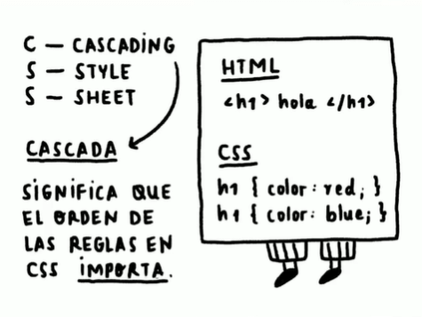

Mira el siguiente código e identifica de qué color de letra tendrá la etiqueta ```<h1>```.

```css
h1 {
    color: red;
}

h1 {
    color: blue;
}
```

La etiqueta ```<h1>``` tendrá un color blue de letra, esto porque está situado más abajo en el código. Esto ocurre con cada propiedad de CSS que se repita en algún punto más arriba del código.

*Qué es especificidad en CSS*

La especificidad consiste en dar un valor a una regla CSS sobre qué tan específico es el estilo, esto para que los navegadores puedan saber qué estilos aplicar sobre otros, independientemente de dónde se encuentren en el código. El estilo se aplicará donde la especificidad sea mayor.

*Tipos de especificidad en CSS*

Existen 6 tipos de especificidad con su respectivo valor, donde X es la cantidad de estilos que lo contienen. Mira la siguiente imagen:

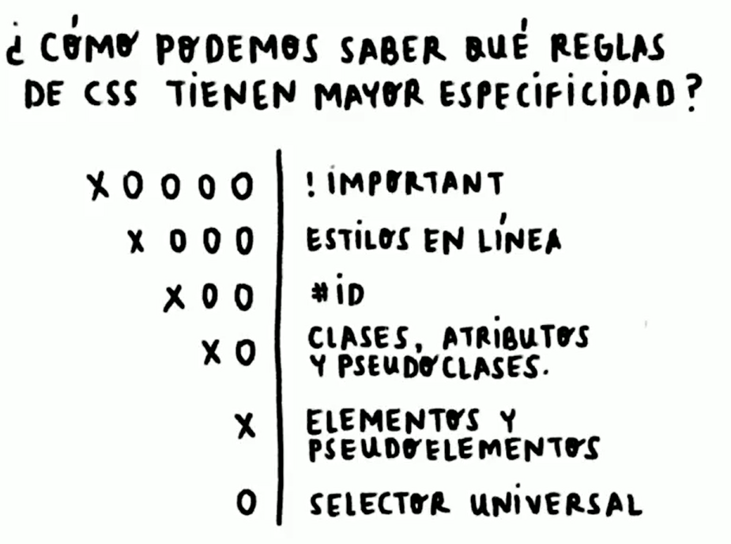

Valor con mayor especificidad
La palabra reservada !important es un valor de toda propiedad CSS que provee una especificidad de 10000, por lo que se aplicará ante otros estilos. Esto es una mala práctica y no deberías utilizarlo.
```css
{
    color: red !important;
}
```

Estilos en línea
Los estilos en línea son las propiedades CSS escritas en el HTML a través de la propiedad style de toda etiqueta. También es una mala práctica y debes evitarlo.
```html
<h1 style="color: blue;">Especificidad</h1>
```

Especificidad en selectores
El tema de los selectores ya lo conoces, por lo tanto, los selectores de tipo ID son más específicos que las clases, atributos y pseudoclases. Estas últimas son más específicas que los elementos y pseudoelementos. El selector universal tiene una especificidad de 0.

En un proyecto deberías evitar los !important y estilos en línea, para trabajar únicamente con la especificidad de los selectores. Sin embargo, debes tener presente que los selectores combinadores suman la especificidad de cada selector básico para obtener la especificidad total de la regla CSS.

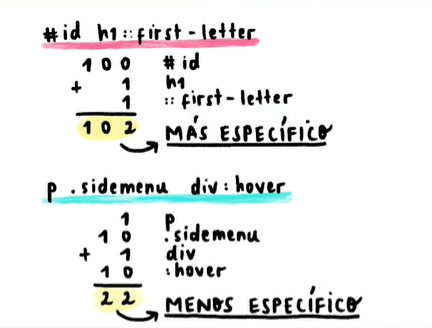

Si utilizas Visual Studio Code y mantienes el mouse sobre el selector, te mostrará la especificidad total. Specificity Calculator es una página web donde puedes calcular la especificidad.
link https://specificity.keegan.st/


**Tipos de display más usados: block, inline e inline-block**

La propiedad ```display``` establece el tipo de visualización de los elementos HTML sin afectar el flujo normal de los elementos.

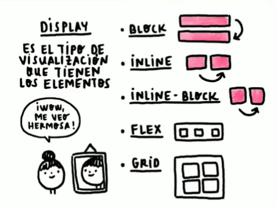

Existen etiquetas que por defecto su display ya está determinado, como la etiqueta ```<div>``` que tiene display block, ```<span>``` tiene display inline y ```<button>``` tiene display inline-block.

Abordaremos los tipos de display ```block```, ```inline``` e ```inline-block``` a continuación.

Visualización en bloque (```block```)
El display block **establece que un elemento ocupará todo el espacio disponible por defecto y el siguiente elemento a este se situará por debajo.

Es posible añadir medidas de anchura ```width``` y altura ```height``` a estos a elementos.

También es posible agregar todas las propiedades del modelo de caja (no te preocupes de este concepto, ya lo abordaremos).

[Ejemplo de display block](https://codi.link/PGRpdj5Tb3kgZGlzcGxheSBibG9jazwvZGl2Pg0KPGRpdj5Tb3kgZGlzcGxheSBibG9jazwvZGl2Pg0KPGRpdiBjbGFzcz0iY29uX21lZGlkYXMiPlNveSBkaXNwbGF5IGJsb2NrPC9kaXY+DQoNCg==%7CLyogUXVpdGEgbG9zIGNvbWVudGFyaW9zIHkgb2JzZXJ2YSBlbCBjb21wb3J0YW1pZW50byAqLw0KZGl2ew0KICBiYWNrZ3JvdW5kLWNvbG9yOiBhcXVhOw0KICAvKiBtYXJnaW46IDEwcHg7ICovDQogIC8qIHBhZGRpbmc6IDEwcHg7ICovDQp9DQoNCi5jb25fbWVkaWRhcyB7DQogIC8qIHdpZHRoOiAyMDBweDsgKi8NCiAgLyogaGVpZ2h0OiAyMDBweDsgKi8NCn0NCg0KLyogSWdub3JhIGVzdG9zIGVzdGlsb3MsIHBvciBhaG9yYSAqLw0KKiB7DQogIGZvbnQtc2l6ZTogMS4ycmVtOw0KICBtYXJnaW46IDA7DQp9DQoNCg0KDQo=%7C) 
Visualización en línea (```inline```)
El display ```inline``` establece que un elemento ocupará el espacio del contenido del mismo y el siguiente elemento se situará a la derecha.
 
No es posible añadir medidas de anchura ```width``` y altura ```height``` a estos a elementos.

También, no es posible agregar todas las propiedades del modelo de caja, únicamente funcionará la propiedad margin en el eje horizontal (no te preocupes de este concepto, ya lo abordaremos).

[Ejemplo de display inline](https://codi.link/PHNwYW4+U295IGRpc3BsYXkgaW5saW5lPC9zcGFuPg0KPHNwYW4+U295IGRpc3BsYXkgaW5saW5lPC9zcGFuPg0KPHNwYW4+U295IGRpc3BsYXkgaW5saW5lPC9zcGFuPg0KPHNwYW4+U295IGRpc3BsYXkgaW5saW5lPC9zcGFuPg0KPHNwYW4gY2xhc3M9ImNvbl9tZWRpZGFzIj5Tb3kgZGlzcGxheSBpbmxpbmU8L3NwYW4+DQoNCg==%7CLyogUXVpdGEgeSBhZ3JlZ2EgbG9zIGNvbWVudGFyaW9zIHkgb2JzZXJ2YSBlbCBjb21wb3J0YW1pZW50byAqLw0Kc3BhbnsNCiAgYmFja2dyb3VuZC1jb2xvcjogYXF1YTsNCiAgLyogbWFyZ2luOiAyMHB4OyAqLw0KICAvKiBwYWRkaW5nOiAyMHB4OyAqLw0KfQ0KDQouY29uX21lZGlkYXMgew0KICAvKiB3aWR0aDogMjAwcHg7ICovDQogIC8qIGhlaWdodDogMjAwcHg7ICovDQp9DQoNCi8qIElnbm9yYSBlc3RvcyBlc3RpbG9zLCBwb3IgYWhvcmEgKi8NCiogew0KICBmb250LXNpemU6IDEuMnJlbTsNCiAgbWFyZ2luOiAwOw0KfQ0KDQoNCg0K%7C)
Visualización de bloque y línea (inline-block)
El display inline-block combina las ventajas de bloque de colocar medidas al elemento y propiedades del modelo de caja correctamente; con las ventajas de inline de color un elemento seguido de otro en el mismo espacio.

Si elemento excede el contenido total, se coloca en la siguiente línea por debajo.
[Ejemplo de display inline-block](https://codi.link/PGJ1dHRvbj5Tb3kgZGlzcGxheSBpbmxpbmUtYmxvY2s8L2J1dHRvbj4NCjxidXR0b24+U295IGRpc3BsYXkgaW5saW5lLWJsb2NrPC9idXR0b24+DQo8YnV0dG9uPlNveSBkaXNwbGF5IGlubGluZS1ibG9jazwvYnV0dG9uPg0KPGJ1dHRvbj5Tb3kgZGlzcGxheSBpbmxpbmUtYmxvY2s8L2J1dHRvbj4NCjxidXR0b24gY2xhc3M9ImNvbl9tZWRpZGFzIj5Tb3kgZGlzcGxheSBpbmxpbmUtYmxvY2s8L2J1dHRvbj4NCg0K%7CLyogUXVpdGEgbG9zIGNvbWVudGFyaW9zIHkgb2JzZXJ2YSBlbCBjb21wb3J0YW1pZW50byAqLw0KYnV0dG9uew0KICAvKiBtYXJnaW46IDEwcHg7ICovDQogIC8qIHBhZGRpbmc6IDEwcHg7ICovDQp9DQoNCi5jb25fbWVkaWRhcyB7DQogIC8qIHdpZHRoOiAzMDBweDsgKi8NCiAgLyogaGVpZ2h0OiAxMDBweDsgKi8NCn0NCg0KLyogSWdub3JhIGVzdG9zIGVzdGlsb3MsIHBvciBhaG9yYSAqLw0KKiB7DQogIGZvbnQtc2l6ZTogMS4xcmVtOw0KICBtYXJnaW46IDA7DQp9DQoNCg0KDQo=%7C)


Visualización nula (none)
El display none desactiva la visualización de un elemento, como si el elemento no existiera.

[Ejemplo de display none](https://codi.link/PGRpdj48L2Rpdj4NCjxkaXY+PC9kaXY+DQo8ZGl2IGNsYXNzPSJkZXNhcGFyZWNlciI+DQogIEVuIG1pIHNpZ3VpZW50ZSB0cnVjbywgwqF2b3kgYSBkZXNhcGFyZWNlciENCjwvZGl2Pg0KPGRpdj48L2Rpdj4NCjxkaXY+PC9kaXY+DQo=%7CLyogUXVpdGEgbG9zIGNvbWVudGFyaW9zIHkgb2JzZXJ2YSBlbCBjb21wb3J0YW1pZW50byAqLw0KLmRlc2FwYXJlY2Vyew0KICAvKiBkaXNwbGF5OiBub25lOyAqLw0KICBiYWNrZ3JvdW5kLWNvbG9yOiBjb3JuZmxvd2VyYmx1ZTsNCiAgDQp9DQoNCi8qIElnbm9yYSBlc3RvcyBlc3RpbG9zLCBwb3IgYWhvcmEgKi8NCiogew0KICBib3gtc2l6aW5nOiBib3JkZXItYm94Ow0KICBmb250LXNpemU6IDEuMXJlbTsNCiAgbWFyZ2luOiAwOw0KfQ0KDQpib2R5ew0KICBkaXNwbGF5OiBmbGV4Ow0KfQ0KDQpkaXZ7DQogIGJhY2tncm91bmQtY29sb3I6IGNvcmFsOw0KICB3aWR0aDogMTIwcHg7DQogIGhlaWdodDogMTIwcHg7DQogIGZvbnQtd2VpZ2h0OiA4MDA7DQogIHBhZGRpbmc6IDhweDsNCn0NCg0KDQoNCg==%7C)

**Tipos de display más usados: flexbox y CSS grid**

El display ```flex``` y ```grid``` son formas de visualización de elementos recientes y cada uno tienen sus propias características para crear interfaces de manera efectiva, a partir de un contenedor padre que dotará a los elementos hijos de superpoderes del posicionamiento.

Ambas son herramientas muy útiles en el desarrollo, especialmente para la creación de interfaces amigables al usuario y aptas para cualquier dispositivo, que este último se lo conoce como responsive design.

Sin embargo, ambas herramientas tienen temas muy extensos de entender, y como mi intención no es estresarte con demasiada información, simplemente ten presente de manera general en qué consisten.
